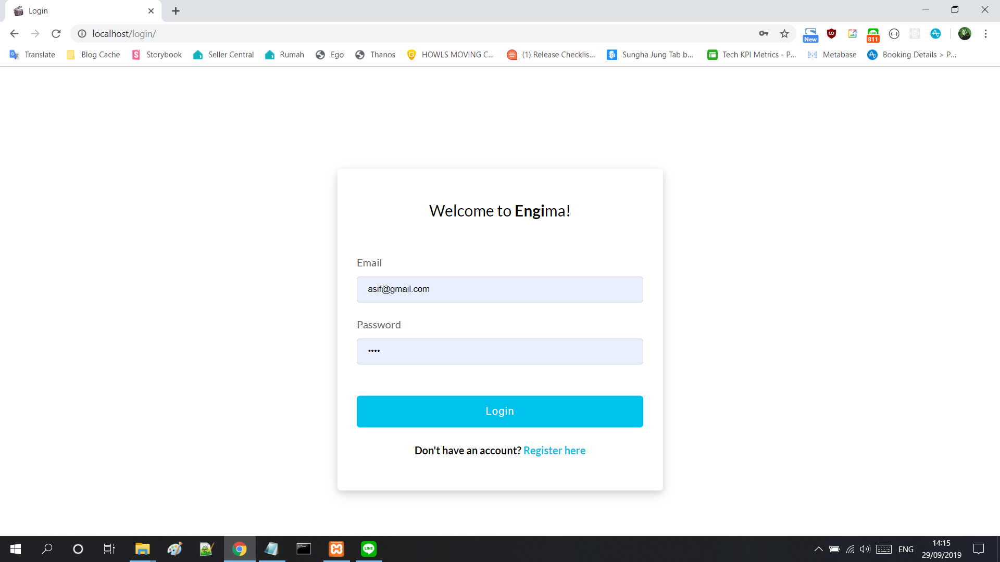
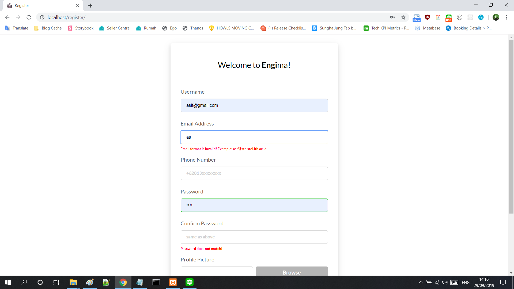
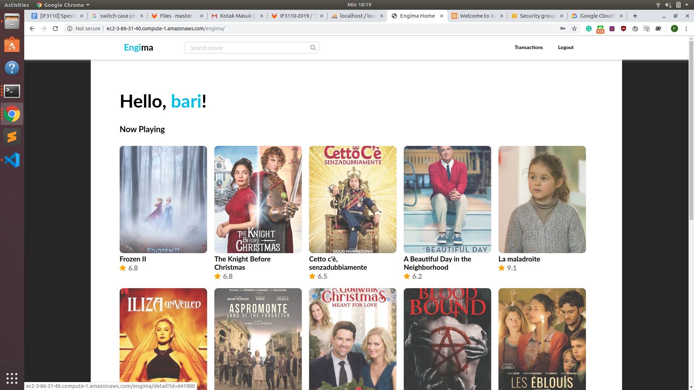
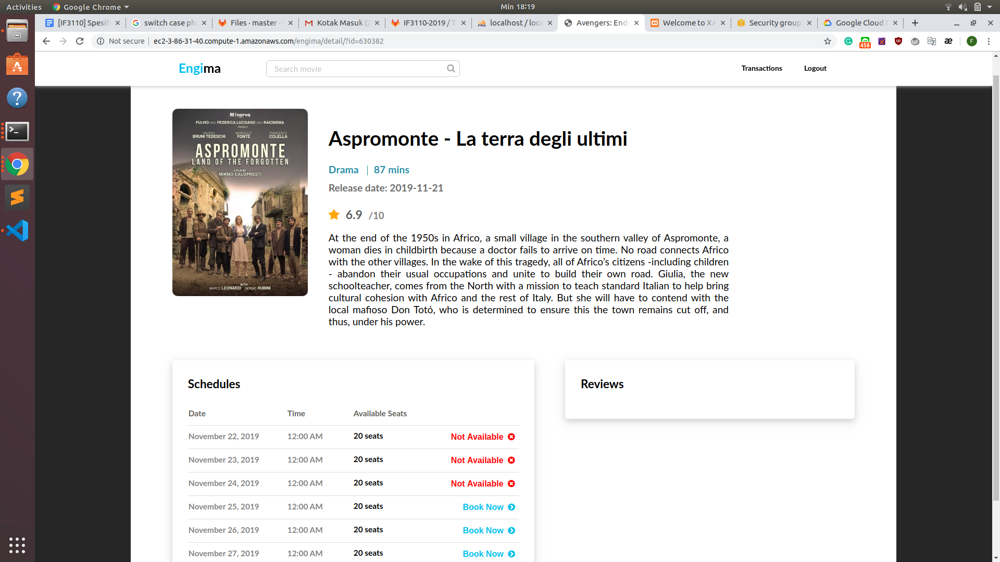
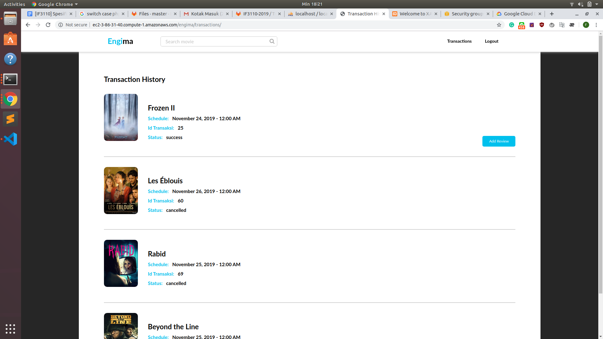
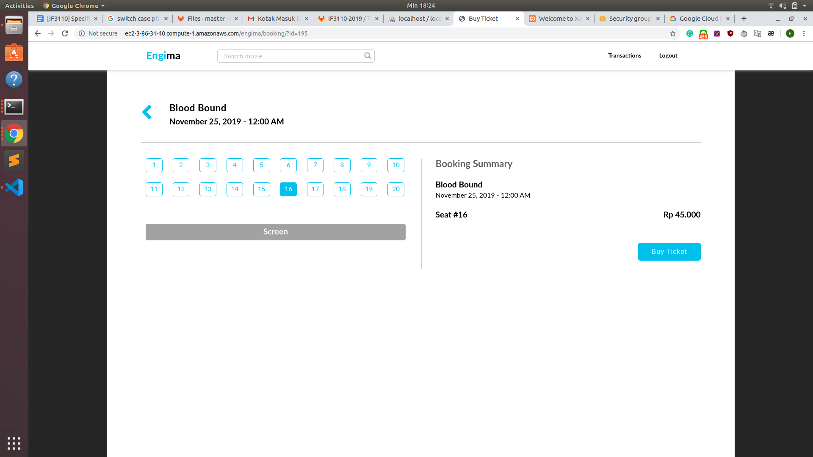

# Engima: Beli Tiket Nonton Online!
## Deskripsi aplikasi Engima
Setelah melakukan pembuatan Aplikasi web Engima, bioskop engi menjadi sangat laku. Aplikasi web Engima sekarang menggunakan web service untuk "mempermudah" pekerjaanya. Setelah menggunakan web service, aplikasi engima tidak menyimpan database transaksi dan data film. Untuk kebutuhan transaksi dipenuhi oleh web service transaksi sedangakan terkait pembayaran akan menggunakan web service bank yang terhubung dengan aplikasi bank pro. 
## Basis data Engima yang telah diubah
- Basis data engima disimpan di Google Cloud Databases
- Data Film menggunakan The Movie Data Bases
- Data transaksi didapat dari web service transaksi
## Screenshot perubahan tampilan pada Engima
## Login 

## Register

## Home

## Movie Detail

## Transactions

## Buy Ticket

## Pembagian tugas
- M. Rifky I. Bariansyah - 13517081
- Faiz Muhammad Muflich - 13517093
- Sekar Larasati Muslimah - 13517114
### REST
1. Mengubah transaksi baru "pending" : 13517093
2. Mengubah status transaksi : 13517081
3. Mengembalikan data transaksi : 13517114
### SOAP
1. Validasi No. rek dan Memberi data rekening nasabah : 13517093
2. Transfer : 13517081
3. Akun virtual : 13517114
4. Transaction history : 13517114
### ReactJS
1. Login : 13517093
2. Transfer : 13517114
3. Riwayat Transaksi : 13517081
### Perubahan Engima
1. Pengambilan data film diambil dari API TheMovieDB : 13517081
2. Halaman Home : 13517093
3. Halaman Film Details : 13517081
4. Halaman Buy Ticket : 13517114
5. Halaman Transaction History : 13517093
6. Halaman Transaction History : 13517114

Link deployment : [Engima](http://ec2-3-86-31-40.compute-1.amazonaws.com/engima/)