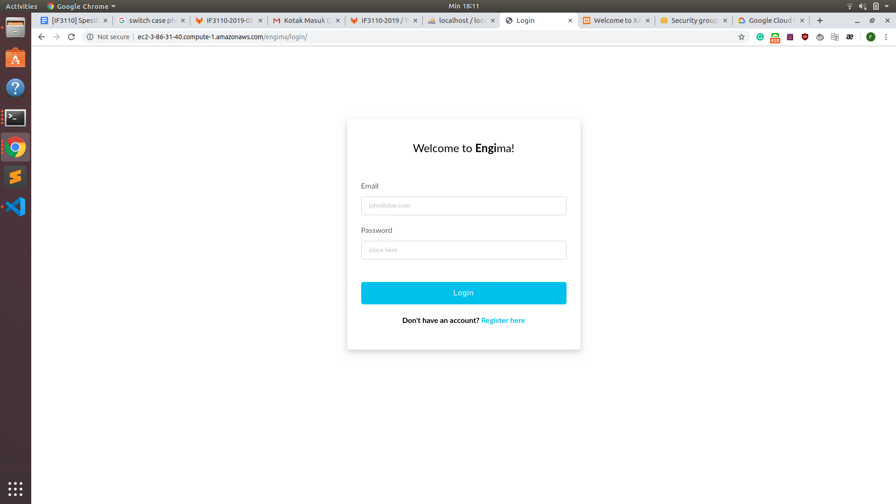

# Engima: Beli Tiket Nonton Online!

## Deskripsi Aplikasi Web

Solusi yang kami tawarkan untuk kebutuhan Engi dalam usahanya untuk ekspansi bisnis ke ranah bioskop adalah dengan mengimplementasi desain *high-level* yang diberikan menjadi aplikasi berbasis web yang ditulis dengan HTML, CSS, JavaScript, dan PHP secara *native*. Aplikasi yang dibuat bernama **Engima**, dengan *server-stack* menggunakan distribusi Apache HTTP Server dan MariaDB yang dikemas dalam *package* XAMPP. Dikarenakan halamannya yang cenderung sedikit, aplikasi ini tidak didesain menggunakan pola arsitektural *model-view-controller*.

Melihat desain UI/UX yang masih dalam bentuk gambar dan batasan-batasan yang diberikan, tentunya kami tidak dapat 100% menyerupai apa yang dispesifikasikan oleh *user* Engi. Namun, usaha kami telah membuahkan hasil aplikasi yang *fully-working* dan tentunya (baca: semoga), tidak ada *bug*.

## Daftar *Requirements*

* Web-browser dari sisi *client* untuk menjalankan kode HTML, CSS, dan JavaScript.
* XAMPP dari sisi *server* untuk menjalankan *server* yang akan menjalankan Apache dan MySQL.

## Instalasi dan Menjalankan Server

Pada OS berbasis Windows, berikut adalah prosedur untuk menginstalasi dan menjalankan *server* aplikasi

* *Install* XAMPP. Lebih mudah jika memasang versi *control panel* dengan antarmuka.
* Ubah **DocumentRoot** dan **Directory** pada `httpd.conf` Apache ke direktori ini (`/tugas-besar-1-2019`).
* Jalankan *server* Apache dan MySQL melalui antarmuka XAMPP dengan mengeklik *action __Start__*.
* Tambahkan *database* baru bernama `WBDDatabase` (dapat melalui PHPMyAdmin). Username dan password yang digunakan pada aplikasi ini yaitu *default*, `root` sebagai username dengan password kosong, sehingga tidak perlu mengubah pengaturan yang bersesuaian pada MySQL *server*.
* Impor *file* `wbddatabase.sql` ke dalam *database* yang baru dibuat.
* Selesai! Untuk mengetes dari sisi *client*, silakan kunjungi `localhost/` melalui web-browser.

Jika langkah di atas telah dilakukan sepenuhnya, untuk menjalankan *server* selanjutnya hanya perlu melakukan langkah ketiga.

## *Screenshot* Tampilan Aplikasi
### Login

### Register

### Home

### Search Result

### Film Detail

### Buy Ticket

### Transaction History

### User Review

## Pembagian Tugas

### Frontend
1. Login : 13517099
2. Register : 13517099
3. Home : 13517114, 13517099 (minor)
4. Search Result : 13517114, 13517099 (minor)
5. Film Detail : 13517099
6. Buy Ticket : 13517099
7. Transaction History : 13517099, 13516066 (minor)
8. User Review : 13517114

### Backend
1. Login : 13517099
2. Register : 13517099
3. Home : 13517099
4. Search Result : 13517099
5. Film Detail : 13517099
6. Buy Ticket : 13517099
7. Transaction History : 13516066
8. User Review : 13516066, 13517114 (minor)
